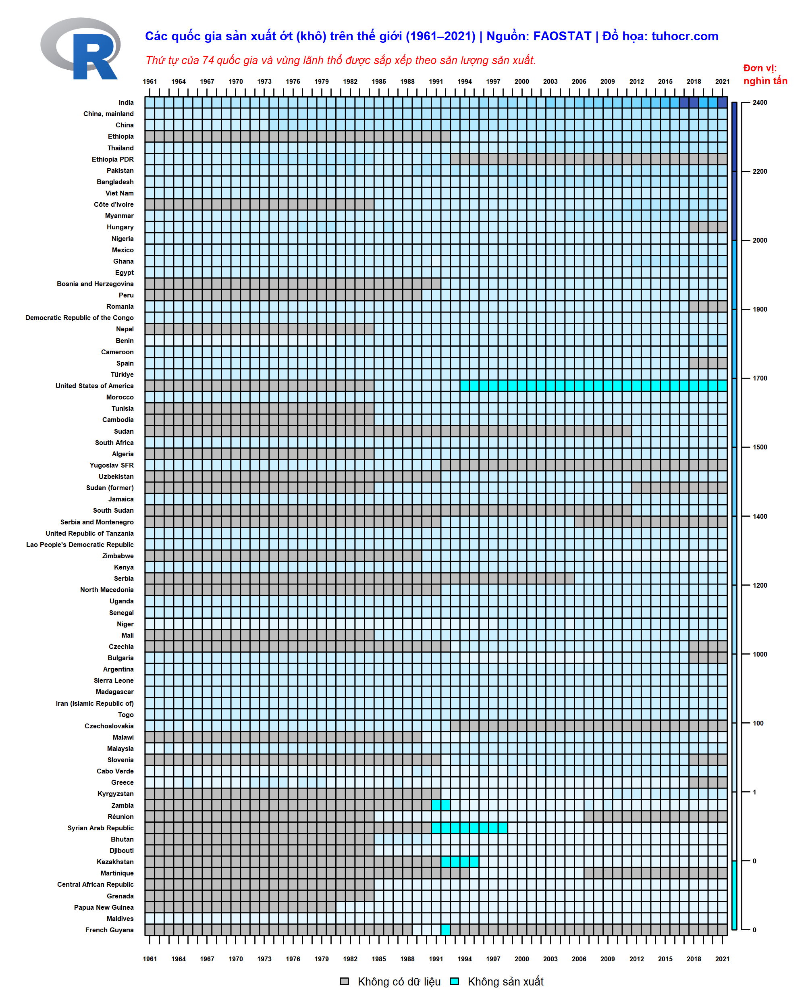
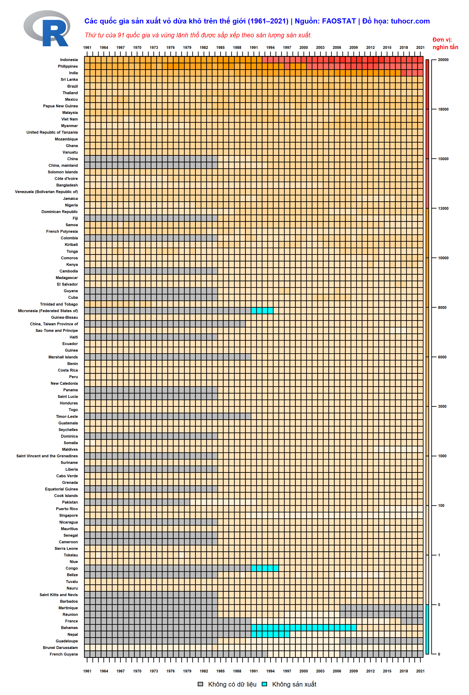

### Đề bài

**Bài tập này kế thừa từ 2 bài trước đó trong chuỗi video hướng dẫn xử lý dữ liệu FAOSTAT**

* [Bài tập làm sạch và sắp xếp dữ liệu](https://studyr.netlify.app/faostat/data-cleaning.html)
    
* [Bài tập trích xuất item trong data frame](https://tuhocr.shinyapps.io/hack2/)

**Bạn có 1 file [`crop_full.rds`](https://studyr.netlify.app/faostat/data_raw/crop_production_all_data.rds) (13.9 MB) chứa dữ liệu về nông nghiệp của FAO, gồm 3.7 triệu dòng. Bạn sử dụng package `FAOSTAT` để download về nhé. Cách thức download file này được mình trình bày ở BÀI 2: CÁCH TẢI DATASET TỪ FAOSTAT trong playlist [HỌC R SIÊU NHANH](https://www.youtube.com/playlist?list=PLCKFKYBfLgPV07MhYMoOMlazOSS7KwKuA).**

**Cấu trúc file này như sau: [crop_full.html](https://studyr.netlify.app/faostat/crop_full.html)**

**Trong file này thì cột `item` là tên các loại nông sản. Bạn hãy tìm cách xây dựng function vẽ heatmap tự động theo nội dung cụ thể bên dưới nhé.**

### Cách thực hiện

**Bước 1: Bạn viết code để vẽ được đồ thị heatmap cho dữ liệu lúa gạo như hình này nhé.**

```{r, message=FALSE, warning=FALSE, echo=TRUE, eval=TRUE}
source(file = "extract_item.R") ## load function để trích xuất dữ liệu theo item
source(file = "ready_data.R") ## load function để xử lữ liệu phù hợp vẽ heatmap
source(file = "produce_heatmap.R") ## load function để vẽ heatmap ảnh gốc để lấy vị trí tọa độ
```

```{r, message=FALSE, warning=FALSE, echo=TRUE, eval=TRUE}
rice_country <- extract_item(input_item = "Rice",
                             input_rds = "data_raw/crop_production_all_data.rds",
                             input_region = "data_raw/FAOSTAT_data_3-21-2023.csv")
```

```{r, message=FALSE, warning=FALSE, echo=TRUE, eval=TRUE}
z <- ready_data(input_data = rice_country, ty_le = 1000000)

produce_image_fixed(input_data = z,
                    file_name = "rice_country_128")
```

```{r, message=FALSE, warning=FALSE, echo=TRUE, eval=TRUE}
 ## bạn click-phải chuột vào hình ảnh để xem full size nhé.
```

**Bước 2: Bạn viết code để vẽ được đồ thị heatmap cho dữ liệu lúa gạo cho top 10, top 20 hoặc top 30 nước sản xuất nhiều nhất trên thế giới. Lưu ý là text, legend, logo đều giữ nguyên vị trí và kích thước như hình gốc để đảm bảo sự đồng bộ.**

**Danh sách top 10 quốc gia sản xuất gạo nhiều nhất trên thế giới**

```{r, message=FALSE, warning=FALSE, echo=TRUE, eval=TRUE}
produce_image(input_data = z[1:10, ],
              file_name = "rice_country_top10") ## ta chỉ cần subset 10 hàng đầu của matrix z


```

**Danh sách top 20 quốc gia sản xuất gạo nhiều nhất trên thế giới**

```{r, message=FALSE, warning=FALSE, echo=TRUE, eval=TRUE}
produce_image(input_data = z[1:20, ],
              file_name = "rice_country_top20") ## ta chỉ cần subset 10 hàng đầu của matrix z


```

**Danh sách top 30 quốc gia sản xuất gạo nhiều nhất trên thế giới**

```{r, message=FALSE, warning=FALSE, echo=TRUE, eval=TRUE}
produce_image(input_data = z[1:30, ],
              file_name = "rice_country_top30") ## ta chỉ cần subset 10 hàng đầu của matrix z


```

### Phần nâng cao

**Bạn xây dựng function sao cho khi vẽ heatmap có thể tùy biến về tựa đề, đơn vị đo cũng như scale màu để khi vẽ cho các dataset tương tự thì cũng nhanh chóng xuất ra heatmap theo cùng chuẩn như của lúa gạo nhé.**

**Vẽ heatmap cho dữ liệu cà phê `item == "Coffee, green"`**

```{r, message=FALSE, warning=FALSE, echo=TRUE, eval=TRUE}
source(file = "produce_heatmap_enhance.R") ## load function vẽ heatmap có nhiều tham số giúp customize đồ thị thuận tiện

coffee_country <- extract_item(input_item = "Coffee, green",
                             input_rds = "data_raw/crop_production_all_data.rds",
                             input_region = "data_raw/FAOSTAT_data_3-21-2023.csv")

z <- ready_data(input_data = coffee_country, ty_le = 1000) # chia đơn vị về nghìn tấn

produce_image(input_data = z,
              file_name = "coffee_country_all",
              don_vi = "Đơn vị: \nnghìn tấn",
              tua_de = "Các quốc gia sản xuất cà phê trên thế giới (1961–2021) | Nguồn: FAOSTAT | Đồ họa: tuhocr.com",
              scale_color = c("#00ffff", hsv(0.15, seq(0.1, 0.9, length.out = 7), 1), 
                              "#ffd966", "#f1c232", "#e69138", "#b45f06", "#783f04"))


```

**Tương tự là heatmap cho dữ liệu hồ tiêu `item == "Pepper (Piper spp.), raw"`**

```{r, message=FALSE, warning=FALSE, echo=TRUE, eval=TRUE}
source(file = "produce_heatmap_enhance.R") ## load function vẽ heatmap có nhiều tham số giúp customize đồ thị thuận tiện

piper_country <- extract_item(input_item = "Pepper (Piper spp.), raw",
                             input_rds = "data_raw/crop_production_all_data.rds",
                             input_region = "data_raw/FAOSTAT_data_3-21-2023.csv")

z <- ready_data(input_data = piper_country, ty_le = 1000) # chia đơn vị về nghìn tấn

produce_image(input_data = z,
              file_name = "piper_country_all",
              don_vi = "Đơn vị: \nnghìn tấn",
              tua_de = "Các quốc gia sản xuất hồ tiêu trên thế giới (1961–2021) | Nguồn: FAOSTAT | Đồ họa: tuhocr.com",
              scale_color = c("#00ffff", hsv(0.25, seq(0.1, 0.9, length.out = 7), 1), 
                              "#93c47d", "#6aa84f", "#38761d", "#274e13", "#1b360d"),
              thang_do = c(0, 0.000000001, 1, 10, 
                                       round(seq(from = 100, 
                                                 to = round(range(z, na.rm = TRUE)[2]*1.2, digits = -1),
                                                 length.out = 9), digits = 0))) ## chủ động thay đổi thang đo heatmap


```

**Heatmap cho dữ liệu ớt (khô) `item == "Chillies and peppers, dry (Capsicum spp., Pimenta spp.), raw"`**

```{r, message=FALSE, warning=FALSE, echo=TRUE, eval=TRUE}
source(file = "produce_heatmap_enhance.R") ## load function vẽ heatmap có nhiều tham số giúp customize đồ thị thuận tiện

chilly_dry_country <- extract_item(input_item = "Chillies and peppers, dry (Capsicum spp., Pimenta spp.), raw",
                             input_rds = "data_raw/crop_production_all_data.rds",
                             input_region = "data_raw/FAOSTAT_data_3-21-2023.csv")

z <- ready_data(input_data = chilly_dry_country, ty_le = 1000) # chia đơn vị về nghìn tấn

produce_image(input_data = z,
              file_name = "chilly_dry_country_all",
              don_vi = "Đơn vị: \nnghìn tấn",
              tua_de = "Các quốc gia sản xuất ớt (khô) trên thế giới (1961–2021) | Nguồn: FAOSTAT | Đồ họa: tuhocr.com",
              thang_do = c(0, 0.000000001, 1, 10, 
                                       round(seq(from = 100, 
                                                 to = round(range(z, na.rm = TRUE)[2]*1.2, digits = -2),
                                                 length.out = 9), digits = 0))) ## chủ động thay đổi thang đo heatmap


```

**Heatmap cho dữ liệu vỏ dừa khô `item == "Coconuts, in shell"`**

```{r, message=FALSE, warning=FALSE, echo=TRUE, eval=TRUE}
source(file = "produce_heatmap_enhance.R") ## load function vẽ heatmap có nhiều tham số giúp customize đồ thị thuận tiện

coconut_country <- extract_item(input_item = "Coconuts, in shell",
                             input_rds = "data_raw/crop_production_all_data.rds",
                             input_region = "data_raw/FAOSTAT_data_3-21-2023.csv")

z <- ready_data(input_data = coconut_country, ty_le = 1000) # chia đơn vị về nghìn tấn

produce_image(input_data = z,
              file_name = "coconut_country_all",
              don_vi = "Đơn vị: \nnghìn tấn",
              tua_de = "Các quốc gia sản xuất vỏ dừa khô trên thế giới (1961–2021) | Nguồn: FAOSTAT | Đồ họa: tuhocr.com",
              thang_do = c(0, 0.000000001, 1, 10, 
                                       round(seq(from = 100, 
                                                 to = round(range(z, na.rm = TRUE)[2]*1.2, digits = -2),
                                                 length.out = 9), digits = 0))) ## chủ động thay đổi thang đo heatmap


```


